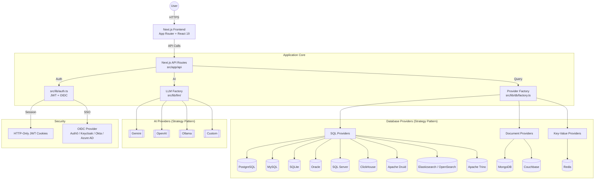
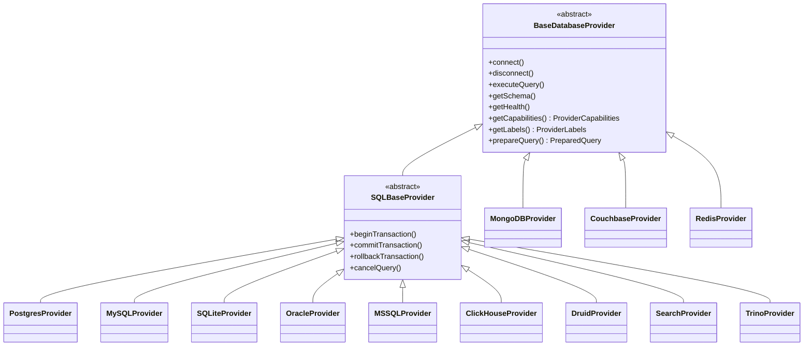
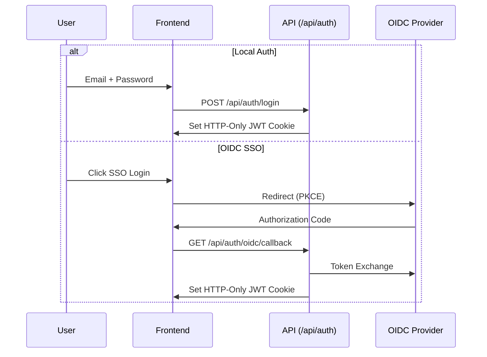

# High-Level Architecture - LibreDB Studio

This document outlines the architectural patterns, tech stack, and system design for LibreDB Studio, a web-based SQL IDE for cloud-native teams.

## System Overview

This custom fork retains LibreDB Studio's Strategy Pattern database abstraction. The
`SHIPPED` record in [`src/lib/db/compatibility.ts`](../src/lib/db/compatibility.ts) is
exhaustive over `DatabaseType`; `elasticsearch` and `opensearch` are two ids served by
one provider module. Implemented types are distinct from the fork's default visible
set: **PostgreSQL, MySQL and SQLite**.

The source supports a **standalone Next.js app** and an **embeddable workspace**. The
inherited npm identity is `@libredb/studio`; that is not a claim of a fork publication
or a particular external consumer. See [§4.6](#46-workspace-abstraction-npm-package-embedding).

## 1. Core Tech Stack

| Layer | Technology |
|-------|-----------|
| Framework | Next.js 16 (App Router) with React 19 |
| Runtime | Bun / Node.js |
| Language | TypeScript (strict mode) |
| Styling | Tailwind CSS 4 + Shadcn/UI |
| Animations | Framer Motion v12 |
| SQL Editor | Monaco Editor |
| Data Grid | TanStack React Table + react-virtual |
| AI | Multi-model (Gemini, OpenAI, Ollama, Custom) |
| Auth | JWT (`jose`) + OIDC SSO (`openid-client`) |
| Charts | Recharts |
| Containerization | Docker (multi-stage Bun build) |

## 2. High-Level Architecture Diagram



## 3. Database Provider Architecture



Each provider implements:
- **`getCapabilities()`** - queryLanguage, supportsExplain, supportsCreateTable, maintenanceOperations, etc.
- **`getLabels()`** - provider vocabulary such as entityName, selectAction and searchPlaceholder; translated UI also uses locale catalogs (§4.10)
- **`prepareQuery()`** - handles query limiting per-provider (SQL LIMIT injection vs MongoDB native)

Registering a type involves the factory, type inventory and UI integration described in
[Adding a Provider](ADDING_A_PROVIDER.md). The separate presentation layer in
[`database-visibility.ts`](../src/lib/database-visibility.ts) filters the normal UI and
managed-connection listing without modifying provider contracts or stored connections.
Its configuration and limits are documented in
[Provider visibility](DATABASE_PROVIDERS.md#provider-visibility-in-this-fork).

`CouchbaseProvider` extends `BaseDatabaseProvider` even though SQL++ is a SQL dialect: SQL++ quotes identifiers with doubled backticks, which `escapeIdentifier()` produces for no existing type, so it owns its quoting and declares its SQL-ness through `queryLanguage: 'sql'` instead. Being reached over HTTP is **not** the reason — `ClickHouseProvider`, `DruidProvider` and `TrinoProvider` add no driver either, and all three extend `SQLBaseProvider`, because double-quoted identifiers are correct in each dialect. Each driver-free provider is a directory rather than a single file, with its wire format behind a transport seam that provider logic never bypasses. Trino inherits everything except the limiter: its grammar is `[ OFFSET count ] [ LIMIT count ]` and only that way round, so `prepareQuery()` transposes the clause the shared limiter emits. See [`docs/providers/couchbase.md`](providers/couchbase.md), [`clickhouse.md`](providers/clickhouse.md), [`druid.md`](providers/druid.md) and [`trino.md`](providers/trino.md).

## 4. Key Architectural Patterns

### 4.1. Strategy Pattern (Database & LLM)

Both database and LLM layers use the Strategy Pattern with a factory:
- `src/lib/db/factory.ts` - Creates the correct database provider based on connection type
- `src/lib/llm/factory.ts` - Creates the correct LLM provider based on configuration

No `isMongoDB` / `=== 'mongodb'` checks outside provider classes. All behavior differences are driven through capabilities and labels.

### 4.2. Authentication Flow



Controlled by `NEXT_PUBLIC_AUTH_PROVIDER` (`local` | `oidc`). Both flows result in the same JWT session cookie. Proxy (`src/proxy.ts`) enforces RBAC (admin vs user roles).

### 4.3. Multi-Statement Execution

`src/lib/sql/statement-splitter.ts` splits SQL input into individual statements, handling:
- String literals (single/double quotes)
- Block and line comments
- Dollar-quoting (PostgreSQL)

Multi-statement queries execute sequentially via `POST /api/db/multi-query`.

### 4.4. Storage Abstraction Layer

- **Write-through cache architecture**: localStorage (L1 cache) + optional server storage (L2 persistent)
- **Three storage modes** controlled by `STORAGE_PROVIDER` env var:
  - `local` (default): Browser localStorage only, zero configuration
  - `sqlite`: Server-side SQLite file via `better-sqlite3`
  - `postgres`: Server-side PostgreSQL via `pg`
- **`useStorageSync` hook** in Studio.tsx: discovers mode at runtime via `/api/storage/config`, pulls on mount, pushes mutations (debounced 500ms)
- **Migration**: First login auto-migrates localStorage to server; `libredb_server_migrated` flag prevents re-migration
- **Graceful degradation**: If server unreachable, localStorage continues working

### 4.5. Client State Management

- **Storage module** (`src/lib/storage/`) for persistent data: connections, query history, saved queries, schema snapshots, chart configs, audit log, masking config, threshold config
- **React hooks** for UI state: tabs, active connection, execution status
- **Custom hooks** extracted from Studio.tsx: `useAuth`, `useConnectionManager`, `useTabManager`, `useTransactionControl`, `useQueryExecution`, `useInlineEditing`

### 4.6. Workspace Abstraction (npm package embedding)

The source provides standalone `src/components/Studio.tsx` and embeddable
`src/workspace/StudioWorkspace.tsx`; `build:lib` builds the inherited package surface
with `tsup`. Standalone owns Next.js routing, authentication integration, locale
resolution and the Agent rail. Embedded execution and connections are supplied by
host adapters, not the standalone query hook. Embedded components use translation
hooks too, so the host must supply the `next-intl` locale/messages context; the
standalone cookie resolver is not automatically an embedding contract.

- **`src/workspace/`** — `StudioWorkspace.tsx` is the embeddable shell. Its adapter hooks (`hooks/use-connection-adapter`, `hooks/use-query-adapter`) let the host (standalone or platform) supply connections and query execution, so the same UI runs in both contexts.
- **`src/exports/`** — barrel modules (`components.ts`, `providers.ts`, `workspace.ts`, `types.ts`) that define the package's public surface; `package.json` `exports`/`main`/`module` point at the tsup `dist/` output.
- **`src/styles/theme.css`** — the semantic colour tokens every exported component resolves through, shipped as `dist/styles.css` (`exports["./styles.css"]`) because `globals.css` is not packaged. A host imports it once: `import "@libredb/studio/styles.css"`. `build:lib` is `tsup && node scripts/copy-theme.mjs` in that order — tsup cleans `dist/`, so the copy has to follow it. See [`docs/ui/theming.md`](ui/theming.md).
- Standalone and embedded chrome differ; validate shared UI changes in both contexts.
  Contributor conventions live in `CLAUDE.md`.

### 4.7. Standalone Boot Flow (`src/instrumentation.ts`)

Next.js runs `register()` once per server worker, **only** when Studio boots its own server (never when `@libredb/studio` is imported by libredb-platform) and only on the Node.js runtime. On standalone boot it:

1. **Bootstraps missing auth env** (`src/lib/auth-bootstrap.ts`, #109). When `JWT_SECRET` / `ADMIN_PASSWORD` are absent they are generated once, persisted to `<data dir>/auth-bootstrap.json` (mode `0600`), and injected into `process.env` before any secret reader runs; the admin password is printed once. Explicitly set env vars always win. Disable with `AUTH_BOOTSTRAP=off|false|0` (case-insensitive); an unrecognized value warns and stays on. In OIDC mode only the JWT secret is generated.
2. **Runs the auth-config preflight** (`src/lib/config/auth-preflight.ts`, #227). A `JWT_SECRET` that is set but shorter than 32 characters prints an operator-facing banner (length only, never the value) and exits with code 1. It runs *after* bootstrap so a generated secret is validated too. This is the one step that intentionally stops boot: `GET /api/db/health` is the Kubernetes livenessProbe and the Docker/PaaS health check, so signalling the failure there would restart the pod forever and hide the login screen's actionable 503; refusing to start costs nothing because a too-short secret can sign no session at all.
3. **Seeds the embedded LibreDB sample** (`src/lib/seed/libredb-sample.ts`). Unless `LIBREDB_EMBEDDED_SAMPLE=false`, it creates `<data dir>/sample.libredb` (idempotently, atomic rename). The editable, dismissable "Sample (LibreDB)" is only advertised by `GET /api/connections/managed` when its provider is visible; the V1 default hides it without deleting its file.
4. **Seeds the embedded SQLite sample, asynchronously** (`src/lib/seed/sqlite-sample.ts`). Unless `SQLITE_EMBEDDED_SAMPLE=false`, it fires-and-forgets a copy of the vendored `seed-assets/sqlite/employee.db` template to `<data dir>/sample-employees.db` (idempotent, atomic rename) — boot never waits. When SQLite is visible, the managed-connections API advertises the in-flight seed id in `pendingSeeds`; `useConnectionManager` polls (1s, max 30) so "Sample (Employees)" appears without a page refresh.

Failures in the bootstrap and seeding steps are logged and swallowed — boot never breaks. The preflight in step 2 is the deliberate exception.

### 4.8. SQLite Driver Selection (`src/lib/db/providers/sql/sqlite-driver.ts`)

The SQLite **DB provider** is runtime-adaptive: it loads `bun:sqlite` under Bun and `node:sqlite` under plain Node (npx / brew / deb installs run `node server.js`). `LIBREDB_SQLITE_DRIVER=bun|node` forces a driver (used by tests). This is distinct from the **storage layer**, whose SQLite backend uses `better-sqlite3`.

### 4.9. Agent Runtime (`src/lib/agent/`, available when AI is configured)

A read-only investigation agent: a model drafts SQL against a connected database, repairs statements that fail, and composes a report whose claims cite the results they came from. Three boundaries define it. Its availability is **derived, not flagged** (#331 T5): the agent exists when a model is configured through the existing `src/lib/llm` settings *and* the durable ledger has a writable path, so no rail renders where the first Start would fail, and the discovery probe answers `{"enabled": false, "reason": …}` naming the condition that is missing — that is how the rail learns to stay absent and how the operator learns why. `LIBREDB_AGENT_ENABLED=false` remains the explicit off-switch. `isAgentRuntimeEnabled()` stays synchronous, answering the off-switch and the model configuration for its five in-request callers; the ledger's writable path is I/O and is composed into the answer by `GET /api/agent/config` alone. It is **standalone-only**, so the `@libredb/studio` package gains no agent module, agent type or runtime dependency (asserted by a package-boundary test); and every database reach goes through the same `src/lib/db/operations/` pipeline as the rest of the app, under a read-only execution profile with the agent's own frozen policy — there is no second path to a driver. A run is an append-only ledger on a durable backend (`WORKFLOW_TARGET_WORLD`: zero-config single-instance `local`, or the opt-in Postgres world for multiple replicas), and it re-derives its state from that ledger, so a resumed run never repeats a tool execution. Model configuration is the existing `src/lib/llm` settings surface — there is no second place to enter a key, and therefore no second reader of one.

Full behaviour, the tool set, what bounds a run, the HTTP surface and the honest limitations: [`docs/AGENT.md`](AGENT.md).

### 4.10. Localization

The standalone application uses `next-intl` with `pt-BR` and `en`.
[`src/i18n/config.ts`](../src/i18n/config.ts) defines pt-BR as the default and English
as the fallback. The request configuration reads the `libredb_locale` cookie;
missing/invalid values resolve to pt-BR. The locale action rejects unsupported values
and persists a supported selection for one year (`path=/`, `sameSite=lax`).

[`load-messages.ts`](../src/i18n/load-messages.ts) uses the English catalog as the
reference and recursively merges pt-BR overrides. Server Components use the helpers
in `src/i18n/server.ts`; the root layout supplies the same locale/messages through
`NextIntlClientProvider`, sets `<html lang>` and generates localized metadata.
Client Components use `useTranslations`, `useLocale` and locale-aware formatting.
The switcher persists the cookie and refreshes the route: no locale URL segment,
`navigator.language` selection or locale preference in localStorage is involved.
Catalogs live in `messages/en/` and `messages/pt-BR/`; database/user content is not a catalog.

### 4.11. Server-side EXPLAIN

Standalone `useQueryExecution` sends original SQL and structured EXPLAIN intent to
`POST /api/db/query`. The server reads the connected provider's capabilities and uses
the registry in `src/lib/explain/` to build SQL. The returned `explainFormat`, not a
client type-id guess, selects the renderer. Background EXPLAIN requests an estimate;
explicit analyze requests can execute the statement and require provider support.
The [API contract](API_DOCS.md#structured-explain-requests) owns request/response and
refusal details; [the editor guide](editor/query-optimization.md#query-explain-integration)
describes the user flow. This is not a general SQL safety boundary.

### 4.12. Preparatory Safe Mode components

[`src/lib/safe-mode/classify.ts`](../src/lib/safe-mode/classify.ts) implements conservative
SQL classification for PostgreSQL, MySQL and SQLite subsets. It reports uncertainty
and limits rather than claiming to understand arbitrary SQL.
[`policy.ts`](../src/lib/safe-mode/policy.ts) evaluates structured classification,
effective environment and resolved configuration into a deterministic decision.
It does not execute SQL, resolve the authoritative connection/environment or enforce
its own `allow`, `warn`, `require_confirmation` or `block` result.

These components are **preparatory: Production Safe Mode is not yet enforced** by the
query, multi-query, transaction or Agent execution paths. Browser confirmation and
Query Safety are advisory/UX mechanisms, not server authorization. Agent read-only
profiles impose separate, engine-specific restrictions; provider capabilities describe
supported operations, not permission to execute them. None of these distinctions is
changed by adding a classifier or policy module. Database privileges remain necessary.

## 5. Directory Structure

```
src/
├── app/                    # Next.js App Router
│   ├── api/
│   │   ├── auth/           # Login/logout/me + OIDC (PKCE, callback)
│   │   ├── ai/             # explain, query-safety, describe-schema
│   │   ├── db/             # Query, schema, health, maintenance, transactions
│   │   ├── storage/        # Storage sync API (config, CRUD, migrate)
│   │   ├── connections/    # managed/ — built-in (seeded) connections listing
│   │   ├── agent/          # Agent runs, stream, artifacts, drive (404 unless enabled — §4.9)
│   │   └── admin/          # Fleet health, audit
│   ├── admin/              # Admin dashboard (RBAC protected) — layout.tsx renders the
│   │   │                   #   shell; one route per section, each independently
│   │   │                   #   linkable/refreshable. `/admin` redirects to the default
│   │   │                   #   section and maps legacy `?tab=` links (src/lib/admin-sections.ts)
│   │   ├── overview/       # Fleet health, quick actions
│   │   ├── operations/     # Maintenance operations
│   │   ├── monitoring/     # Embedded monitoring dashboard
│   │   ├── security/       # Data masking, access control
│   │   └── audit/          # Audit log
│   ├── monitoring/         # Monitoring dashboard page
│   └── login/              # Login page
├── components/
│   ├── Studio.tsx           # Main application shell (standalone)
│   ├── QueryEditor.tsx      # Monaco SQL editor wrapper
│   ├── ResultsGrid.tsx      # Virtualized data grid
│   ├── SchemaDiagram.tsx    # React Flow ERD viewer
│   ├── agent/               # AgentRail + timeline/hydration folds (standalone only — §4.9)
│   ├── sidebar/             # ConnectionsList, ConnectionItem
│   ├── studio/              # StudioTabBar, QueryToolbar, BottomPanel
│   ├── results-grid/        # ResultCard, RowDetailSheet, StatsBar
│   ├── admin/               # AdminDashboard shell (5 section routes) + tabs/ panels
│   ├── monitoring/          # MonitoringDashboard + tabs
│   ├── schema-explorer/     # SchemaExplorer
│   └── ui/                  # Shadcn/UI primitives
├── workspace/               # Embeddable shell (StudioWorkspace) + host adapter hooks
├── exports/                 # Public npm-package barrel exports (tsup build:lib)
├── hooks/                   # Custom React hooks
├── i18n/                    # Standalone locale resolution, catalog loading, server helpers
└── lib/
    ├── database-visibility.ts # Presentation allowlist; not authorization
    ├── explain/             # Server-selected strategies and plan render adapters
    ├── safe-mode/           # Preparatory classifier + pure policy; not execution enforcement
    ├── db/                  # Database provider module
    │   ├── providers/
    │   │   ├── sql/         # postgres, mysql, sqlite (+ sqlite-driver runtime adapter), oracle, mssql, clickhouse/ (transport seam + SQL over HTTP), druid/ (transport seam + SQL over POST /druid/v2/sql), search/ (transport seam + SQL over HTTP; elasticsearch and opensearch, two ids one module), trino/ (transport seam + SQL over the Trino client protocol), cassandra/ (transport seam + CQL over the native protocol via cassandra-driver), libsql/ (transport seam + SQLite's dialect over the Hrana protocol), duckdb/ (driver seam + an embedded analytical engine over @duckdb/node-api)
    │   │   ├── document/    # mongodb, couchbase/ (transport seam + SQL++ over REST)
    │   │   ├── keyvalue/    # redis
    │   │   └── embedded/    # libredb (built-in embedded provider for the sample connection)
    │   ├── factory.ts       # Provider factory
    │   └── types.ts         # Database types
    ├── agent/               # Agent runtime: run ledger, workflow, tools, policy (docs/AGENT.md)
    ├── llm/                 # LLM provider module
    ├── editor/              # Monaco completions (SQL + MongoDB), the tab-type/language ladder,
    │                       # and the LibreDB + Redis command languages
    ├── schema-diff/         # Diff engine + migration SQL generator
    ├── export/              # The writers behind every "save this to disk": RFC 4180 CSV,
    │                        #   the SQL INSERT/DDL forms, and the one blob-download path
    ├── sql/                 # Statement splitter, alias extractor
    ├── seed/                # Seed connections (config, filter, credential resolver) + libredb-sample seeding
    ├── config/              # auth-env.ts — single JWT_SECRET reader (auth.ts, proxy.ts, oidc.ts)
    ├── api/                 # API error codes + schema-route helpers
    ├── ssh/                 # SSH tunnel support
    ├── auth.ts              # JWT utilities
    ├── auth-bootstrap.ts    # Zero-config first-run auth bootstrap (runs in instrumentation)
    ├── oidc.ts              # OIDC utilities
    └── storage/             # Storage abstraction layer
        ├── index.ts         # Barrel export
        ├── storage-facade.ts # Public sync API + CustomEvent dispatch
        ├── local-storage.ts  # Pure localStorage CRUD
        ├── factory.ts       # Env-based provider factory
        └── providers/       # SQLite + PostgreSQL backends
```

## 6. Deployment

Published images, packages and channel references below belong to upstream. They do
not establish published artifacts or supported deployments for this custom fork.

- **Docker / Helm**: Multi-stage Bun build with standalone Next.js output; these channels resolve their bind address in the container entrypoint, preferring a dual-stack `::` that they verify by connecting an IPv4 client to a throwaway listener, and falling back to `0.0.0.0` where the namespace has no usable IPv6. `HOSTNAME` (chart: `config.bindAddress`) overrules that and is honoured verbatim. Canonical image `ghcr.io/libredb/libredb-studio`.
- **Native channels** (`bin/studio.js` npx launcher, Homebrew tap, `.deb`/`.rpm`, Snap, standalone tarballs; sources under `bin/` and `packaging/`): local-first, bind `127.0.0.1` by default unless `--host`/`HOSTNAME` opts in. The npx launcher ships as a pure library and downloads the SHA256-verified standalone server tarball from GitHub Releases. Full matrix and per-channel details in [`docs/DISTRIBUTION.md`](DISTRIBUTION.md).
- **Health Check**: `GET /api/db/health`
- **Scaling boundaries**: do not treat the whole API as stateless. Provider pools,
  transaction handles, cancellation tracking and rate-limit counters have process-local
  state. Agent ledger storage has its own single-instance/local versus Postgres-world
  configuration (see §4.9); changing that backend does not make every other subsystem
  replica-independent. Storage, routing and deployment constraints must be evaluated
  together before adding replicas.
- **Environment**: Configured via `.env.local` (see CLAUDE.md for full variable list). Missing auth secrets are generated on first standalone boot — see [§4.7](#47-standalone-boot-flow-srcinstrumentationts).
